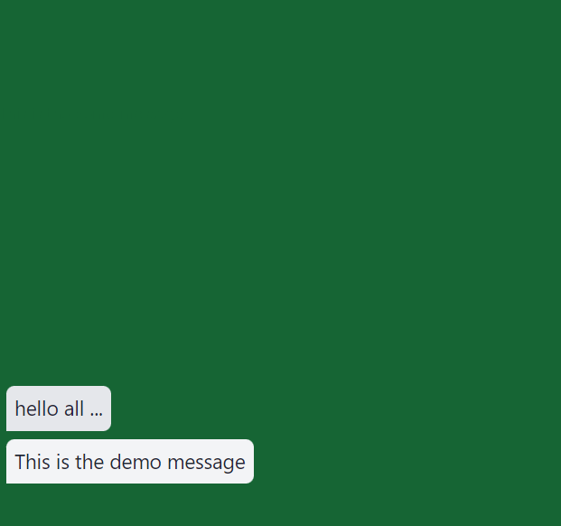

# Green Screen Chat Bubble Component for Video Editing

  

This is a customizable green screen chat bubble component that can be seamlessly integrated into video editing projects. It was developed using React.js and styled with Tailwind CSS.

## Features

- Create realistic chat bubble overlays for video editing with green screen capability.
- Perfect for adding chat conversations, tooltips, and more to your videos.

# Usage

- Visit the URL <a href="" target="_blank" />
- ScreenRecord the site and start typing.
- Use any video editor and remove the greenscreen and use as a element in your videos

Inspired from @craftzdog. 

Feel free to contribute, open issues, or submit pull requests to enhance this Green Screen Chat Bubble Component for video editing. Your contributions are greatly appreciated!
